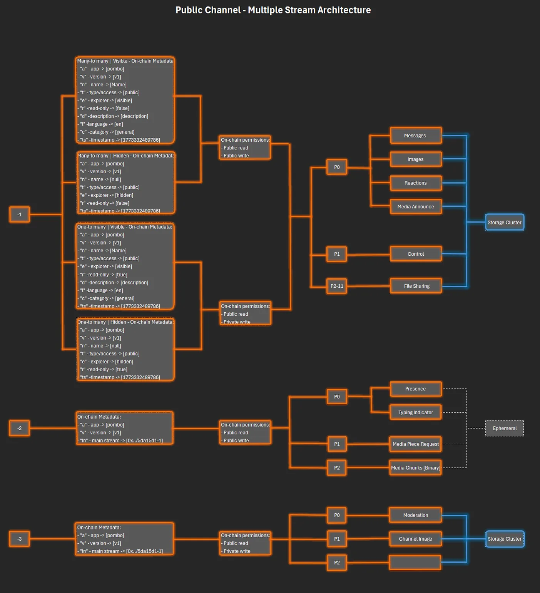
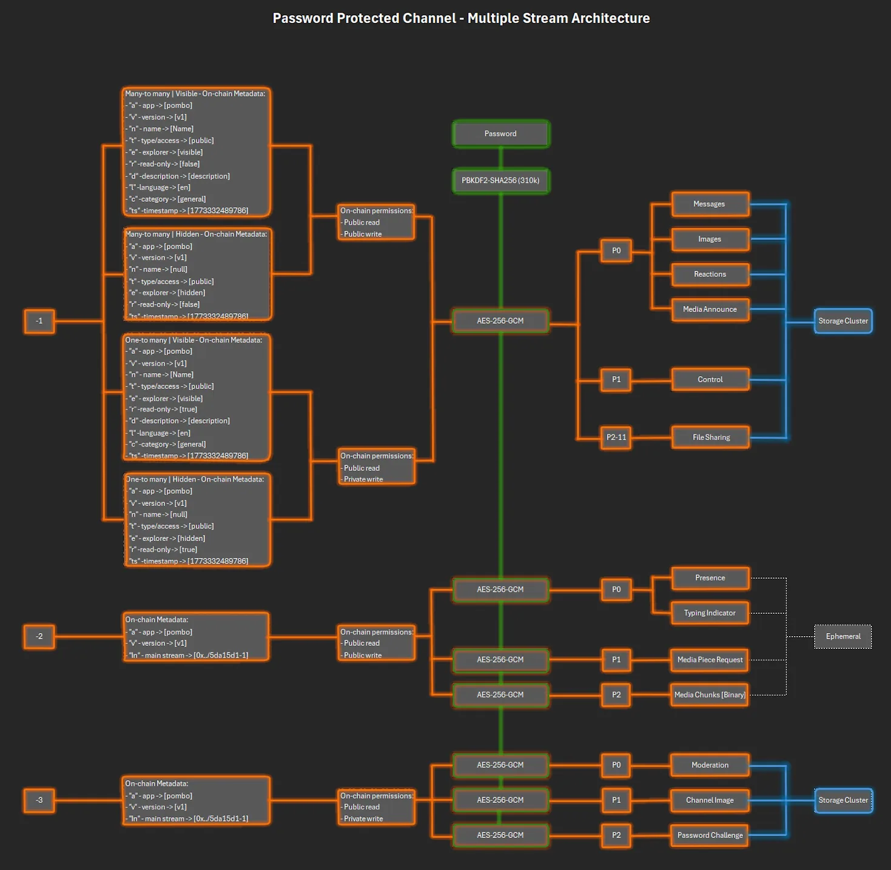
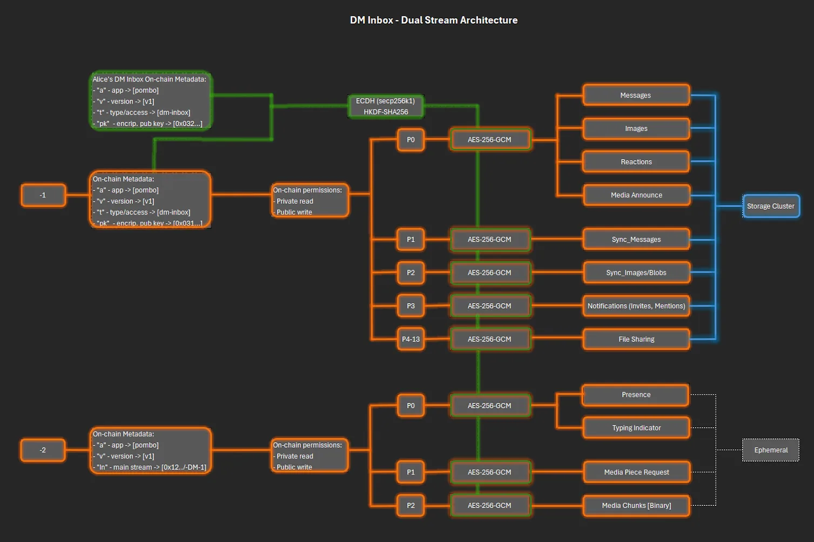

import Tabs from '@theme/Tabs';
import TabItem from '@theme/TabItem';

# Architecture

Pombo has no message backend — conversations never pass through a Pombo server. The client sits on top of three decentralized layers — transport, persistence, and ownership — and handles all cryptography itself:

```
┌─────────────────────────────────────────────┐
│  Pombo client (browser PWA / Android app)   │
│  identity · encryption · UI                 │
├─────────────────────────────────────────────┤
│  Streamr Network      →  message transport  │
│  (P2P pub/sub)           & delivery         │
├─────────────────────────────────────────────┤
│  Storage nodes        →  message history    │
│  (Streamr + Cassandra)   & offline delivery │
├─────────────────────────────────────────────┤
│  Polygon PoS          →  ownership &        │
│  (Streamr registries)    permissions        │
└─────────────────────────────────────────────┘
```

- **Transport — Streamr Network.** Messages are published to *streams* (topics) and propagate peer-to-peer between subscribers. No relay server sits in the middle of your conversations.
- **Ownership — Polygon PoS.** Streams are registered on-chain in the Streamr registry contracts. The record of who owns a channel and who may publish or subscribe to it is public blockchain state — not a row in someone's database. On-chain writes (creating a channel, granting membership) cost a small fee in POL; everything else is free.
- **Persistence — storage nodes.** Streamr nodes running the storage plugin retain stream history, so messages reach people who were offline. Channel owners choose the storage node and the retention period. See [Storage and persistence](storage-and-persistence.md).
- **Cryptography — your device.** Keys are generated and used locally. DM encryption, protected-channel encryption and message signing all happen client-side before anything is published. Two deliberate choices are worth knowing: the Streamr SDK's own encryption layer is **disabled** — all confidentiality is applied at the app layer — and channel messages are published under a per-channel throwaway key carrying a signed proof of the real account inside the payload (in contract-backed channels, the publisher is the membership contract instead; see [Privacy model](privacy-model.md)).

Beyond these layers, the client talks to a small set of auxiliary services — public RPC endpoints, The Graph, the push relay, the Explore curation manifest — none of which handle message content. The full list and what each one sees is in the [threat model](../security/threat-model.md).

## Anatomy of a channel

Every channel is a set of Streamr streams under the creator's address — three for open and protected channels, four when membership is contract-backed:

| Stream | Stored? | Partitions | Purpose |
|---|---|---|---|
| `…-1` Message stream | Yes | 11 | Chat content (P0), edit/delete control messages (P1), file chunks (P2–P10) |
| `…-2` Ephemeral stream | No | 3 | Presence and typing (P0), live P2P media signals (P1) and data (P2) |
| `…-3` Admin stream | Yes | 3 | Moderation state (P0), channel image (P1), password challenge (P2) — writable only by the owner |
| `…-4` Keys stream | Yes | 1 | Distribution of the channel's encryption keys — closed, gated and paid channels only |

The stream ID itself has the form `{ownerAddress}/{id}`, which is what makes ownership self-evident: the creator's address is part of the channel's name.

The keys stream is stored on purpose: it is what makes joining a private channel asynchronous. A newcomer's key request waits there until some member comes online to answer it, instead of both having to be connected at the same moment. See [Encryption](encryption.md#closed-gated-and-paid-channels).

The full picture per channel type — on-chain metadata, permissions, partitions, and where encryption applies (click to zoom):

<Tabs>
<TabItem value="open" label="Open channel">



*Content flows unencrypted; the four metadata variants cover visible/hidden and read-only combinations.*

</TabItem>
<TabItem value="protected" label="Protected channel">



*Same layout as an open channel, but every partition's content passes through AES-256-GCM with a PBKDF2-derived key (green path); the admin stream gains the password-challenge partition.*

</TabItem>
<TabItem value="native" label="Closed, gated and paid channels">

Diagram coming soon — contract-backed channels add the keys stream to the layout above. Every stream's permission is held by one grantee, the channel's membership contract, and content is encrypted under a channel key distributed over `…-4`. See [Gated and paid channels](gated-and-paid-channels.md).

</TabItem>
</Tabs>

## Direct messages: the mailbox model

Each user has a personal **DM inbox** — a deterministic pair of streams derived from their address: a stored message stream (13 partitions: messages, sync, notifications, file chunks) and an ephemeral one for presence and typing. Its permissions are the inverse of a normal channel: **anyone can publish** into it, but **only the owner can subscribe** (read). The inbox metadata also carries the owner's encryption public key, which is what lets anyone seal a message to them.

Sending a DM means encrypting a message for the recipient and dropping it into their inbox. Because the inbox is backed by a storage node, the recipient doesn't need to be online — they pull their inbox history when they next open the app. This is what makes Pombo's DMs asynchronous, like a phone's SMS inbox, rather than requiring both parties online.

Your own inbox also doubles as your **cross-device sync channel**: the app writes self-encrypted state snapshots to it, so a second device logged into the same account converges to the same contacts, channels and settings.



*The inbox publishes the owner's encryption public key as on-chain metadata (green); every partition — messages, sync, notifications, file chunks — is sealed with a key derived via ECDH + HKDF before it touches the network.*

## The interface is replaceable

Pombo (the app at app.pombo.cc) is *an* interface to this protocol, not *the* system. All of the state — identities, channels, permissions, history — lives on public networks. Anyone can build another client against the same streams, and if the Pombo interface vanished, the protocol and your data would remain.
